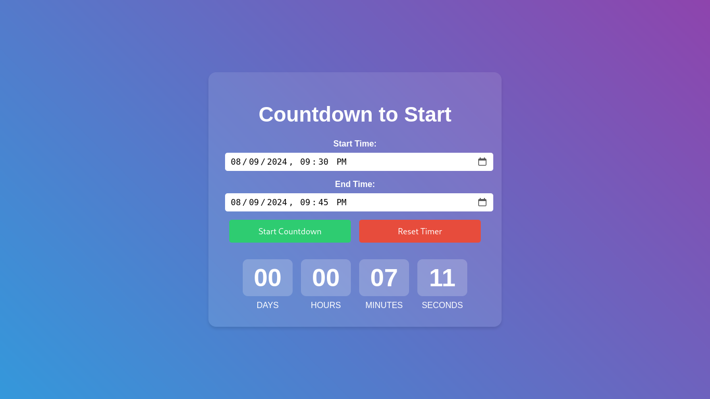

# Responsive-CountDownTimer

# **Languages:**
> HTML CSS JAVASCRIPT ``I'm using internal css and javascript so remember this.``

```
git clone https://github.com/CryptoQuestVikas/Responsive-CountDownTimer
cd Responsive-CountDownTimer
```

# **Screenshot**

